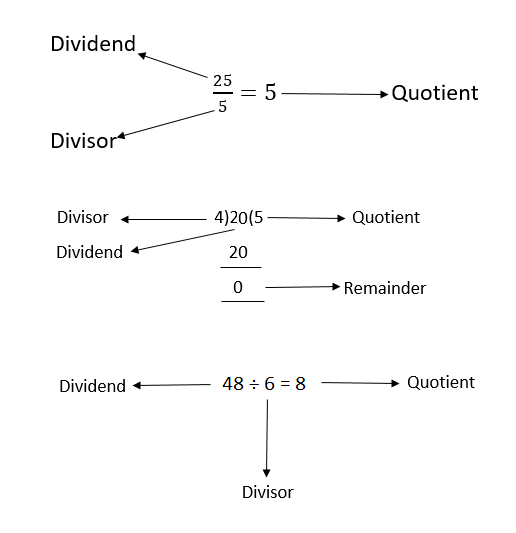



Modulo atau Modulus adalah operasi yang mencari sisa bagi (*Remainder*) dari *dividend* dibagi dengan *divisor*.

Operasi modulo memiliki simbol \\(mod\\) atau `%` yang dipakai beberapa bahasa pemrograman. `%` yang dipakai bahasa pemrograman tidak ada hubungannya dengan persentase.

$$
  21 \space{mod}\space 9 = 3
$$

Bagaimana bisa \\(3\\)? 

Karena dividend bulat terdekat adalah \\(9*2=18\\), 

Lalu dengan mengurangi dividend dengan dividend terdekat \\(21-18\\), 

Kita mendapatkan \\(3\\)

> Core concept dari operasi ini adalah: kita hanya peduli kemana larinya sisa bagi-bagi, layaknya pengawas koruptor

## Certain Conditions

Bagaimana jika dividend lebih kecil daripada divisor?. Selama ini untuk mencari sisa, jumlah yang ingin dibagikan harus lebih besar daripada pesertanya, namun bagaimana jika sebaliknya?.

Operasi modulo **mengembalikan nilai devidend yang kecil tersebut** jika kondisinya seperti yang dikatakan.

$$
  5 \space{mod}\space 8 = 5
$$

Ini kasusnya sering digunakan saat konversi desimal ke biner:

$$
  5_{10} = n_2\\\
  5 \space{mod}\space 2 = 1\\\
  2 \space{mod}\space 2 = 0\\\
  1 \space{mod}\space 2 = 1\\\
  5_{10} = 101_2\\\
$$