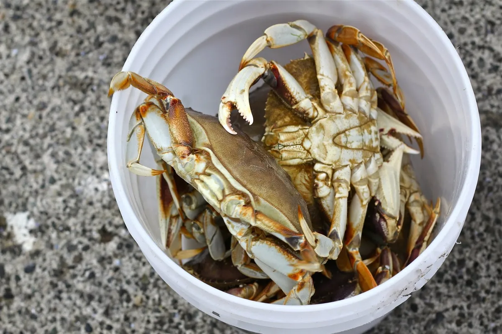

Disini penulis menggunakan *Nyinyir*, *Julid*, *Ghibah*, *Mengunjing*, *Mencaci maki* secara interchangebly karena ada di kategori yang sama dan kenapa ucapan terhadap orang yang kamu ghibah dan caci adalah ketakutan terbesarmu yang sebenarnya?.

## Nyinyir itu tidak ada gunanya

Ketika mengumpat terhadap seseorang dibelakang ataupun didepan, maka dia secara tidak sadar mengungkapkan keinginan terbesarnya terhadap apa yang dimiliki orang itu dan tidak akan pernah mencapainya.

Crab mentality menjelaskan hal ini. Ketika kau menuduh tetangga, seorang pengusaha resto omset 50jt perbulan memakai cara licik (jimat, guna-guna, ordal) untuk dapat omset sebesar itu, ini secara tidak sadar kau memiliki mentalitas yang tidak bisa keluar kotak, tidak bisa seperti dia dan tidak akan pernah seperti dia sampai kau berhenti dan mencoba belajar dari tetangga itu.

Ah, *“palingan dia pake pelaris itu…”*, atau *“palingan itu pake warisan ortu, kalo warisan ortu gaada mah dia ga bisa apa-apa…”*, ucap kau, seorang karyawan kantoran gaji UMR yang selalu di tegur atasan karena kurang disiplin.

## Kisah seseorang yang berteduh di goa

Atau ibaratnya, seseorang berlindung diri di goa ditemani sebuah api yang menghangatkan, dengan begitu dia merasa seolah-olah sudah aman untuk selamanya dan tidak perlu keluar dari goa?, *keep dreaming man...*. Dia perlu memerdekakan diri dan tidak hanya bermanfaat bagi diri sendiri namun orang lain disekitarnya, karena sejatinya manusia adalah makhluk sosial yang butuh interaksi satu sama lain.

Disaat api mulai mengecil dan suhu semakin rendah, dia selalu menyalahkan, mengunjing sesuatu yang tidak akan pernah dicapainya karena kegagalannya. Menyalahkan tuhan, memukul batu sekeras mungkin, akhirnya dia bergumam mengharapkan sesuatu namun sebenarnya dirinya pasrah tidak peduli diri sendiri.

Dia harus keluar dari goa dan menghadapi derasnya air hujan, gemuruh petir, dinginnya udara dan terbatasnya penglihatan, kumpulkan beberapa ranting kayu basah terdekat, cari buah buahan disekitar, pulang ke goa dan urus hasil buruannya barusan, itu namanya memerdekakan diri.

## Pandangan psikologi

Ghibah adalah salah satu dari bentuk ekpresi atau pelampiasan atas kegagalanmu dalam suatu hal. Kamu mencari selimut yang hangat untuk menghangatkan dirimu dari dinginnya realita.

Sebenarnya, mengapa kau tidak pernah merasa selesai Ketika mencaci orang adalah karena itu melepaskan sebuah dopamine instant dalam otakmu, kamu tidak akan pernah selesai dan melakukannya terus menerus karena ini pelepasan dopamine secara instan.

Sederhananya, dopamine instan tejadi ketika mendapatkan sebuah kesenangan dengan proses yang instan/cepat dan kau tidak akan pernah puas ketika tidak menikmati prosesnya. Ketika mengumpat kau merasa bahagia melampiaskannya, namun merasa bersalah karena orang mendengar perkataan buruk darimu. Kau akan mengulangi siklus itu terus, menerus dan menerus, hal ini sangat mirip dengan masturbasi dan narkotika.

## Apa yang harus dilakukan

Manusia selalu mengasosiasikan dirinya kedalam suatu kelompok, itulah bukti bahwa kita makhuk sosial. Semakin buruk dirimu, maka akan semakin dijauhi orang baik. Jadi, daripada menghibah menggunjing tidak jelas bukankah lebih baik bertanya atau komunikasi kepada orang itu untuk melawan dan menghilangkan ketakutanmu untuk selamanya.

Jika kau di nyinyirin atau orang tidak suka padamu, berusahalah untuk menjadi lebih sopan dan baik menghadapinya, perlahan tapi pasti, angin yang santai akan mengikis sebuah batu yang kasar.

