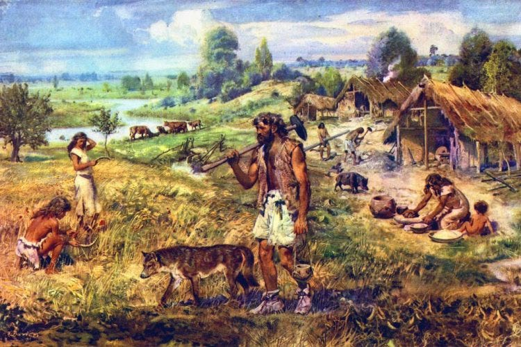
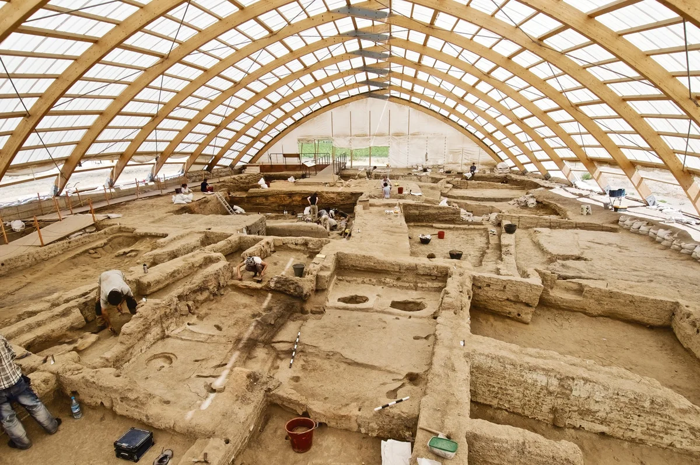
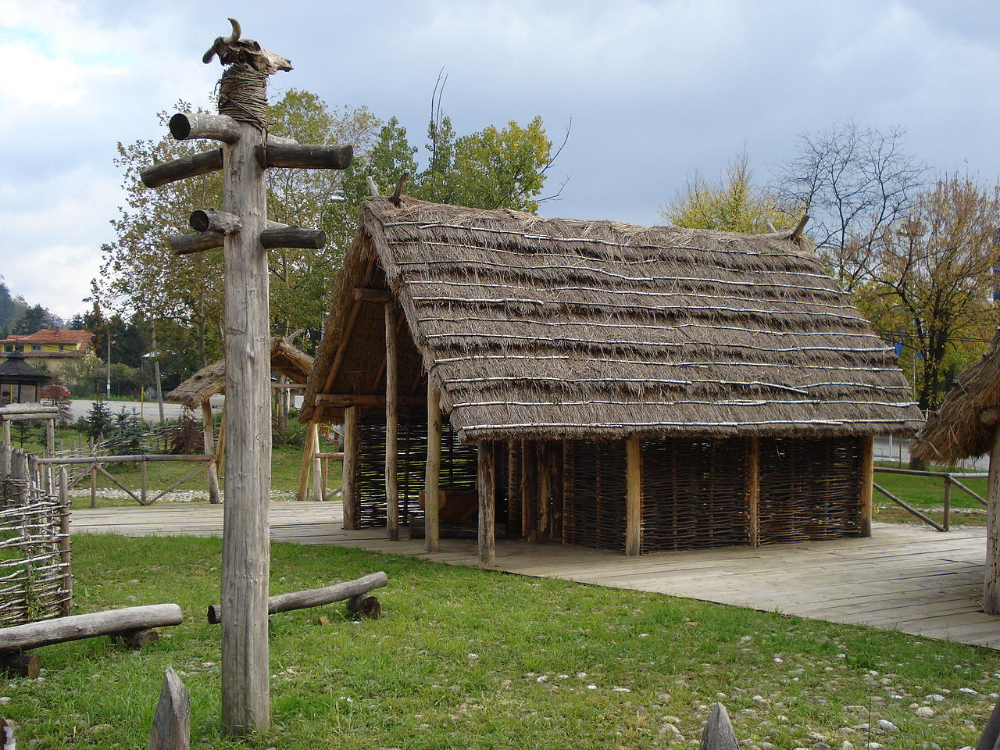

The [Neolithic](https://en.wikipedia.org/wiki/Neolithic) is the final period of the entire stone age, also known as the new stone age (`νέος`, *néos*, new + `λίθος`, *líthos*, stone). This period is famous for its agricultural practices and sedentary settlements.

This period occurred in the range of c. 10,000ya - 6000ya or 8000SM - 4000SM if calculated in AD. In the Middle East, this period occurred earlier than regions such as Europe or China with a difference of 2000 years. As a result, there was so called *[Cradle of Civilization](https://en.wikipedia.org/wiki/Cradle_of_civilization)*.

## Agricultural Revolution / Neolithic Revolution

It was a gigantic breakthrough in history. Humans managed to engineer natural resources en masse for the first time in history.

Early evidence of agriculture actually occurred in the Paleolithic period, even 10,000 years before the agricultural revolution occurred, precisely at the [Ohalo II](https://en.wikipedia.org/wiki/Ohalo_II)[^1] site, the coast of Lake Tiberias. They were still dabbling on a small scale.

This revolution not only succeeded in engineering food but also created the same lifestyle, sedentary living and social stratification as modern times. There was less variation in diet, clay-tiled houses for each family, and a more specialized division of labor.

The domestication of animals also occurred simultaneously, because in addition to relying on plants, they also raised cattle, pigs, goats, sheep, poultry. But the first animal resulting from human domestication was dog (*Canis lupus familiaris*) from wolf (*Canis lupus*) which has been domesticated since 14,000 BC[^2].

Livestyle became sedentary as humans abandoned hunting as a top priority. An example is the settlement at [Çatalhöyük](https://en.wikipedia.org/wiki/%C3%87atalh%C3%B6y%C3%BCk).

Clothes were still made of leather sewn with bone needle fiber thread, but in the middle of the period began to use wool or linen.

## Social and Culture

In this period, the egalitarian culture began to erode over time and women's competitiveness began to decrease because their focus was once equal to men, now they only took care of children and food in the house.

Social inequality is a relevant problem in modern times that first appeared in this period, the cattle and farming culture made families/groups compete with each other for income, and eventually some of them lost their competitiveness.

Tribalism began to dominate, usually a group was led by a figure who was the most charismatic among them.

## Technologies

This period gave birth to an architectural style that differed from house to house in different regions.

A significant invention of this period was the grain mill and sickle as tools for farming. Tools and weapons had perfect shapes. Adze and axe were used extensively for construction.

## Next Age

After this age, humans experienced rapid and significant technological growth due to this sedentary culture. Humans began to recognize abstract concepts such as economy, state, religion, philosophy in terms of basic in the copper age, iron age and so on.

[^1]: https://www.sciencedaily.com/releases/2015/07/150722144709.htm
[^2]: https://www.nationalgeographic.com/history/article/ancient-pet-puppy-oberkassel-stone-age-dog