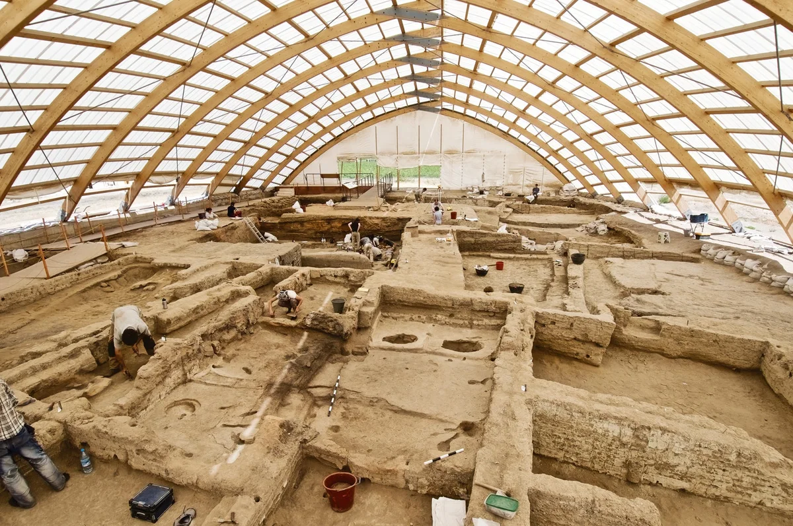

[Neolithic](https://en.wikipedia.org/wiki/Neolithic) adalah periode final dari keseluruhan zaman batu, atau dikenal juga dengan zaman batu baru (`νέος`, *néos*, baru + `λίθος`, *líthos*, batu). Periode ini terkenal dengan praktik agrikultur dan pemukiman menetap.

Periode ini terjadi pada kisaran c. 10.000ya - 6000ya atau 8000SM - 4000SM jika dihitung masehi. Di Timur Tengah, periode ini lebih awal terjadi daripada wilayah seperti Eropa atau China dengan selisih 2000 tahun. Akibatnya, Timur Tengah pun mendapat julukan *[Cradle of Civilization](https://en.wikipedia.org/wiki/Cradle_of_civilization)*.

## Revolusi Agrikultur / Revolusi Neolithic

Merupakan sebuah *Gigantic Breakthrough* dalam sejarah. Manusia berhasil merekayasa sumber daya alam secara massal untuk pertama kalinya dalam sejarah.

Bukti awal agrikultur sebenarnya sudah terjadi pada masa Paleolithic, bahkan 10.000 tahun sebelum revolusi agrikultur terjadi, tepatnya di situs [Ohalo II](https://en.wikipedia.org/wiki/Ohalo_II)[^1], pesisir Danau Tiberias. Mereka masih mencoba-coba dalam skala kecil kecilan.

Revolusi ini selain berhasil merekayasa pangan juga menciptakan pola hidup, tempat tinggal menetap dan stratifikasi sosial yang sama seperti zaman modern ini. Variasi diet yang mulai mengecil, dibuatnya rumah-rumah dari keramik tanah liat untuk setiap keluarga, dan pembagian pekerjaan yang lebih banyak dan spesialis.

Domestikasi hewan juga terjadi bersamaan, karena selain bergantung dengan tumbuhan, mereka juga ternak sapi, babi, kambing, domba, unggas. Namun hewan pertama hasil domestikasi manusia adalah anjing (*Canis lupus familiaris*) dari serigala (*Canis lupus*) yang sudah di domestikasi sejak 14.000SM[^2].

Pola tempat tinggal menjadi menetap karena manusia sudah meninggalkan berburu sebagai prioritas paling atas. Contohnya pemukiman di [Çatalhöyük](https://en.wikipedia.org/wiki/%C3%87atalh%C3%B6y%C3%BCk).

Pakaian masih terbuat dari kulit yang dijahit dengan benang serat jarum tulang, namun di pertengahan periode mulai menggunakan bahan wol ataupun linen (serat dari tumbuhan yang di silang-silang).

## Sosial dan Budaya

Diperiode ini, budaya egaliter mulai tergerus seiring berjalannya waktu dan daya saing perempuan mulai berkurang dikarenakan fokus mereka yang dulunya setara laki-laki, sekarang mereka hanya mengurus anak dan pangan didalam rumah.

Ketimpangan sosial adalah masalah relevan di zaman modern yang pertama kali muncul pada periode ini, budaya ternak dan tani membuat keluarga/kelompok saling bersaing pendapatan, dan akhirnya ada beberapa dari mereka yang kalah saing.

Budaya tribalisme mulai mendominasi, biasanya sebuah kelompok dipimpin oleh seorang figur yang paling karismatik diantara mereka.

## Teknologi

Periode ini melahirkan sebuah gaya arsitektur yang berbeda-beda di setiap rumah di wilayah yang berbeda.

Sebuah penemuan yang signifikan di periode ini adalah gilingan gandum dan arit sebagai alat keperluan bertani. Perkakas dan senjata memiliki bentuk sempurna. Beliung dan kapak digunakan secara ekstensif untuk konstruksi.

## Zaman Selanjutnya

Sesudah Zaman ini, manusia mengalami pertumbuhan teknologi yang cepat dan signifikan dikarenakan budaya tinggal menetap yang seperti ini. Manusia mulai mengenal konsep abstrak seperti ekonomi, negara, agama, filosofi dalam hal fundamental di zaman tembaga, zaman besi dan seterusnya.

[^1]: https://www.sciencedaily.com/releases/2015/07/150722144709.htm
[^2]: https://www.nationalgeographic.com/history/article/ancient-pet-puppy-oberkassel-stone-age-dog