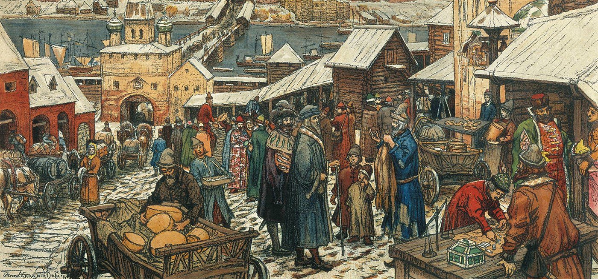

When you work hard for the food you buy at the grocery store, you realize that the food you buy must have come from a farmer.

Ironically, scientists argue that the economic inequality you are experiencing is caused by the farmer whose crops you are buying. But how so?

## Get to know our previous lifestyle

 
In human evolution, our ancestors have gone through three lifestyle to survive, *first* scavenger, scavenger namely *Homo Habilis*, *second* hunter-gatherer which started from *Homo  Erectus* and the *last* is the sedentary pattern which started from *Homo  Sapiens* and is still running until now.

The transition to farming is the main cause of us hunter-gatherers becoming sedentary. Or better known as the [Neolithic Revolution](https://en.wikipedia.org/wiki/Neolithic_Revolution) or the first agricultural revolution.
 
## Primitive Communism

 
How come, we used to practice communism without realizing it before farming. To call this communism is actually a bit of an exaggeration, rather we humans actually lived egalitarian lives before the agricultural revolution.

The hunter-gatherer culture forced them at that time to live more fairly and share equally the results of the hunt. Gender specialization in the division of tasks was also not too specific at that time. 

Even if there was some kind of commotion, it would happen between individuals or groups that were relatively small. If someone tried to be superior, they would be bullied and ostracized.

But why, because the food they got at that time didn't have a surplus and the challenging wild environment, it also made them never think about private property and chose cooperation and egalitarianism as a survival strategy.

> When nature is the biggest challenge to survival, why not find friends to fight nature for survival?

### Women in this era

Women also take turns foraging for food with men, women are seen as equal to men. Food had to be shared equally with everyone, and it was usually the women who had the right to do this.

Uniquely, relationships at the time were generally monogamous and birth cycles averaged every 4 years compared to the post-revolutionary birth cycles of every 1 year.

## The Agricultural Revolution brought both blessings and disasters

12,000 years ago or around 10,000 BC, a transition occurred because for the first time in history, humans were able to manipulate the natural resources around them. Agriculture was discovered and became the foundation of human culture and life until now.

### Socio-economic disparities

Agriculture has also shaped the social and cultural structures that we know today, but despite all the progress we've made, it has also created one of the biggest problems that we have yet to find a solution to: inequality.

Inequality is possible because humans started to recognize the ownership of land and food that had surplus stocks. When crops were in excessive surplus, farmers had to find ways to turn this wealth around. Exchanging their wealth by paying people as *warriors* to guard the land from threats and *priests* to pray for a successful harvest created new jobs and social structures that didn't exist before.
 

 
While farmer A managed to hire a soldier and a priest, there were also two farmers B and C who were less fortunate due to crop disease or drought, and farmer A did not know that farmer D and his 4 wives had more troops and slaves working for him. Surely this is a picture of social and economic inequality that was common at that time and is still relevant today.

### Surplus crops create economy and innovation

As the surplus continued to rotate, new jobs related to farming began to emerge and this created an economic cycle where food and goods were needed as commodities.

The farmer needs someone who is good at making pottery for his farming needs, but he doesn't have time to learn how to make pottery, *why doesn't he get someone to make pottery for him and pay him with his crops*. From here, new jobs were created and the economy was running.

As time went by, humans thought of something universal that could be accepted as a medium of exchange other than crops, eventually gold and silver coins became the universal medium of exchange for transactions of goods and services (TL;DR: Money).
 

As the wheels of this economy continue to turn and create new, more specialized and varied jobs, innovation accelerates. People just need a way to earn money, and money can make anything happen (TL;DR: Capitalism).

Despite all that, we still haven't solved this one problem, inequality. Dynamics continue to occur and those who are not relevant will continue to be left behind by the changing times due to accelerated innovation. Not to mention the greed that tries to outsmart this dynamic, where the rich get richer and the poor get poorer.

 
### Women are outmatched by men
 
Since the existence of farming, women began to lose competitiveness with men in anything. Women seem to be *second class citizens* throughout history. Where initially women were equal in their work division with men, now women are only limited to being active in jobs that tend to be light and home-based, such as taking care of children and cooking.
 
This lack of competitiveness makes women vulnerable to being "commoditized" by men, resulting in cultural products such as prostitution, polygamy, harems, patriarchy and so on.

However, this does not always go to the extreme as there are cultural products such as religion and law that create a norm to respect women, *because boy also come out of her's womb*.

## Post-revolutionary human health

After the agricultural revolution, humans are required to keep up with the times with the dynamics of rapid change. 
However, this certainly has side effects on human health both physically and mentally.

The study found a shrinking of the human physique since the agricultural revolution until now. Before the revolution, hunter-gatherer humans had a wide variety of diets that made the nutrients they absorbed also varied. However, since the advent of agriculture, humans have only relied on one staple, the crops. This led to deficiencies in certain nutrients, leading to new diseases.

Not to mention talking about pests and domesticated animals that became agents of disease, and also the sanitation at that time was also not good. Overall, the quality of life at that time was very poor. But, by realizing how poor the quality of life they had at that time made them realize that it must be improved and as innovation advances, we get that good quality of life until now.

### Human mental state

> Good times creates weak men.

Over time, the weak-minded are spoiled by the quality of life created by the strong-minded. This cycle will continue to spin and continue to be experienced by all civilizations.

Some people are demotivated and lost because they are left behind in keeping up with the dynamics of the times, and there are also those who value their lives and set their goals as high as possible for the sustainability of future generations.

One evidence that we often experience this mental and health adaptation is that *circadian rhythm*, the internal clock in the human brain that regulates when to sleep and wake up, is disrupted by midnight sleep hours due to overtime and setting alarms for the next day, leaving only 3 hours of sleep for you and as a result, emotional disruption and this has the potential to bring new diseases.

This *circadian* rhythm could be the result of our ancestors hundred thousands of years ago eventually made a schedule of sleeping 8 hours at night and hunting during the day.

## How humans continue to adapt in the future

Humans will continue to look for solutions to the problems they experience, but these solutions will inevitably lead to new problems and will continue to create a complex world.

> We reap what we sow.

## References

- https://www.theguardian.com/inequality/2017/dec/05/how-neolithic-farming-sowed-the-seeds-of-modern-inequality-10000-years-ago

- https://bigthink.com/culture-religion/what-started-poverty/

- https://www.youtube.com/watch?v=XTYz4m5AcKY&pp=ygUUYXBlcnR1cmUgYWdyaWN1bHR1cmU%3D
