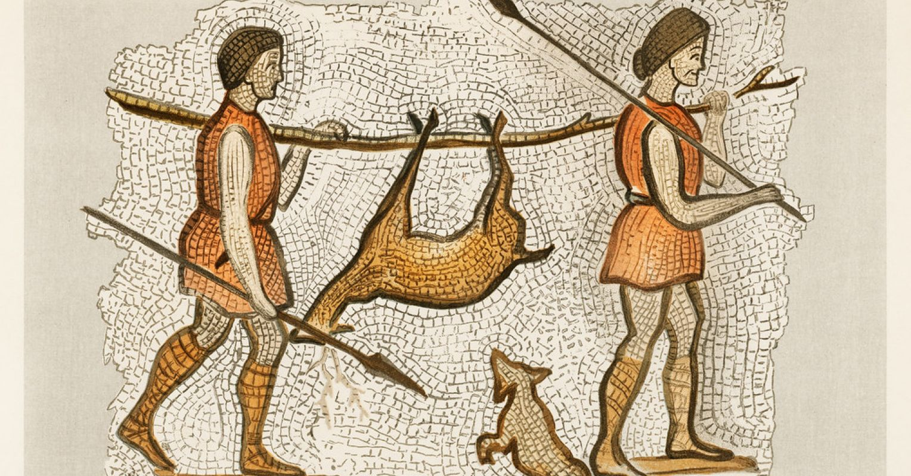

Ketika kamu banting tulang mencari kerja demi makanan yang kamu beli di toko, kamu pasti menyadari makanan yang kamu beli itu pasti datangnya dari seorang petani.

Ironisnya, ilmuwan berpendapat bahwa kesenjangan ekonomi yang sedang kamu alami disebabkan oleh si petani yang hasil panennya kamu beli tadi. Tapi bagaimana bisa begitu?

## Mengetahui pola hidup kita sebelumnya

Dalam evolusinya manusia, nenek moyang kita pernah melewati tiga pola untuk bertahan hidup, *pertama* scavenger, pemakan bangkai yaitu *Homo Habilis*, *kedua* hunter-gatherer yang dimulai dari *Homo Erectus* dan yang *terakhir* adalah pola sedentary yang dimulai dari *Homo Sapiens* dan masih berjalan sampai sekarang.

Transisi bertani adalah penyebab utama kita yang dulunya hunter-gatherer menjadi sedentary. Atau yang lebih dikenal dengan [Neolithic Revolution](https://en.wikipedia.org/wiki/Neolithic_Revolution) atau revolusi agrikultur pertama.

## Komunisme Primitif

Bagaimana bisa, kita dulu pernah menerapkan sistem komunisme tanpa disadari sebelum adanya bertani. Untuk menyebut ini komunisme sebetulnya agak berlebihan, lebih tepatnya kita manusia sebenarnya hidup egaliter sebelum revolusi agrikultur.

Budaya hunter-gatherer memaksa mereka pada saat itu untuk hidup lebih adil dan membagi rata hasil buruan. Spesialisasi gender dalam pembagian tugas pun juga tidak terlalu spesifik pada saat itu. 

Jikalaupun ada semacam keributan, itupun pasti terjadi antar individu atau kelompok yang relatif sengat kecil. Jika ada orang yang mencoba untuk lebih superior, maka dia akan mendapatkan perundungan dan dikucilkan.

Tapi kenapa?, karena makanan yang mereka dapatkan pada saat itu tidak mengalami surplus ditambahnya lingkungan liar yang menantang, itu juga membuat mereka tidak pernah kepikiran soal kepemilikan pribadi dan memilih kerja sama dan egalitarianisme sebagai strategi bertahan hidup.

> Ketika alam adalah tantangan terbesar dalam bertahan hidup, kenapa tidak mecari teman untuk melawan alam dalam bertahan hidup?

### Perempuan dimasa ini

Wanita juga bergantian mencari makanan dengan laki-laki, wanita dipandang setara dengan laki-laki. Makanan harus dibagi merata ke semua orang, dan biasanya yang berhak dalam hal membagi ini adalah wanita.

Satu lagi yang unik, hubungan pada saat itu umumnya monogami dan siklus kelahiran rata-rata 4 tahun sekali dibanding dengan siklus kelahiran setelah revolusi yang terjadi rata-rata 1 tahun sekali.

## Revolusi Agrikultur membawa berkah sekaligus bencana

12.000 tahun yang lalu atau sekitaran 10.000SM, sebuah transisi terjadi karena untuk pertama kalinya dalam sejarah, manusia sudah bisa memanipulasi sumber daya alam yang ada di sekitarnya. Agrikultur ditemukan dan menjadi pondasi dalam budaya dan kehidupan manusia sampai sekarang.

### Kesenjangan sosial dan ekonomi

Agrikultur juga membentuk struktur sosial dan budaya yang seperti kita kenal saat ini, namun dibalik kemajuan yang kita capai atas itu semua, agrikultur juga mencipakan sebuah masalah terbesar yang sampai sekarang ini kita belum temukan solusinya, yaitu kesenjangan.

Kesenjangan bisa terjadi karena manusia mulai mengenal kepemilikian lahan dan makanan yang mengalami surplus stok. Ketika hasil panen mengalami surplus berlebihan, petani harus mencari cara untuk memutar kekayaan ini. Menukar kekayaan mereka dengan membayar orang sebagai *tentara* yang menjaga lahan dari ancaman dan *pendeta* untuk berdoa agar panen gacor berhasil menciptakan pekerjaan baru dan struktur sosial yang sebelumnya tidak ada.

Ketika satu petani A berhasil menyewa seorang tentara dan pendeta, ada juga dua petani B dan C yang kurang beruntung karena faktor penyakit tanaman atau kekeringan, selain itu petani A juga tidak tahu diatasnya ada petani D dan 4 istrinya yang memiliki pasukan lebih banyak dan budak yang bekerja untuknya. Tentunya ini gambaran kesenjangan sosial dan ekonomi yang umum pada waktu itu dan masih relevan sampai sekarang.

### Surplus panen menciptakan ekonomi dan inovasi

Karena surplus terus berputar, pekerjaan baru yang berkaitan dengan bertanian pun mulai muncul dan ini menciptakan sebuah perputaran ekonomi dimana makanan dan barang yang dibutuhkan sebagai komoditas.

Petani membutuhkan seorang yang pandai membuat gerabah untuk kebutuhan bertaninya, namun dia tidak punya waktu untuk belajar membuat gerabah, *mengapa ia tidak menyuruh orang untuk membuat gerabah untuknya dan membayar dangan hasil panennya?*. Dari sinilah pekerjaan baru tercipta dan roda perekonomian berjalan.

Seiring berjalannya waktu, manusia memikirkan sesuatu yang universal yang dapat diterima sebagai alat tukar selain hasil panen, akhirnya koin emas dan silver menjadi alat tukar universal untuk transaksi barang dan jasa (TL;DR: Uang).

Roda perekonomian ini terus berputar dan menciptakan sebuah pekerjaan baru yang lebih spesialis dan bervariasi, akselerasi inovasi terjadi. Manusia hanya perlu cara mendapatkan uang, dan uang dapat menjadikan segalanya terjadi (TL;DR: Kapitalisme).

Dibalik itu semua, tetap saja kita belum bisa menyelesaikan permasalahan satu ini, kesenjangan. Dinamika terus terjadi dan yang tidak relevan akan terus tertinggal digerus oleh perubahan zaman akibat percepatan inovasi. Belum lagi keserakahan yang mencoba mengakali dinamika ini, dimana si kaya semakin kaya dan si miskin semakin miskin.

### Perempuan kalah saing dengan laki-laki

Semenjak adanya bertani, perempuan mulai kalah saing dengan laki-laki dalam hal apapun. Perempuan seakan-akan menjadi *second class citizen* sepanjang sejarah. Yang awalnya perempuan setara divisi pekerjaannya dengan laki-laki, sekarang perempuan hanya sebatas aktif dalam pekerjaan yang cenderung ringan dan rumahan, seperti mengasuh anak dan memasak.

Kalah saing ini membuat perempuan rawan menjadi "komoditas" oleh *oknum* laki-laki, menghasilkan produk budaya seperti pelacuran, poligami, harem, patriarki dan sebagainya.

Namun, hal ini tidak selalu terjerumus ke hal yang ekstrim karena ada beberapa produk budaya seperti agama dan hukum yang menciptakan sebuah norma untuk menghormati perempuan, *karena laki-laki juga keluar dari rahim seorang ibu*.

## Kesehatan manusia pascarevolusi

Sesudah revolusi agrikultur ini terjadi, manusia dituntut untuk mengikuti perkembangan zaman dengan dinamika perubahan yang sangat cepat. Namun, hal ini pastinya memiliki efek samping terhadap kesehatan manusia baik secara fisik maupun mental.

Studi menemukan adanya pengecilan terhadap fisik manusia semenjak revolusi agrikultur sampai sekarang. Sebelum revolusi, manusia hunter-gatherer memiliki variasi diet yang luas sehingga membuat asupan nutrisi yang mereka serap juga bervariasi. Tapi, semenjak adanya agrikultur manusia hanya bergantung terhadap satu bahan pokok saja yaitu hasil panennya. Ini menyebabkan adanya defisiensi terhadap asupan nutrisi tertentu sehingga mendatangkan penyakit baru.

Belum lagi berbicara soal hama dan hewan domestikasi yang menjadi agen penyakit, dan juga sanitasi pada masa itu juga kurang baik. Overall, kualitas hidup pada masa itu sangat buruk. Tapi, dengan menyadari betapa buruknya kualitas hidup yang mereka miliki pada saat itu membuat sadar kalau itu harus diperbaiki dan seiring majunya inovasi, kualitas hidup yang baik itupun kita peroleh sampai sekarang.

### Kualitas mental manusia

> Good times creates weak men.

Seiring berjalannya waktu, orang bermental lemah dimanja dengan kualitas hidup yang dibuat oleh orang bermental gigih. Siklus ini akan terus berputar dan terus dialami oleh semua peradaban.

Beberapa orang kehilangan motivasi dan tidak tahu arah karena mereka terputus atau ketinggalan dalam mengikuti dinamika zaman, dan ada juga yang menghargai hidupnya dan memasang cita-cita setinggi mungkin untuk keberlangsungan generasi kedepannya.

Salah satu bukti yang sering kita alami dari adaptasi mental dan kesehatan ini adalah *circadian rhythm*, jam internal dalam otak manusia yang mengatur kapan waktunya tidur dan bangun, terdisrupsi oleh jam tidur tengah malam akibat lembur dan memasang alarm untuk hari esoknya, menyisakan jam tidur hanya 3 jam untukmu dan akibatnya, emosional terganggu dan ini berpotensi mendatangkan penyakit baru.

Ritme *circadian* ini bisa saja hasil peninggalan nenek moyang kita ratusan tahun lalu yang membuat jadwal tidur 8 jam di malam hari dan berburu di siang hari.

## Bagaimana manusia terus beradaptasi kedepannya

Manusia akan terus mencari solusi terhadap masalah yang dialami, namun solusi tersebut pasti akan menimbulkan masalah baru lagi dan akan seperti itu secara terus menerus menciptakan dunia yang kompleks.

> We reap what we sow.

## Referensi

- https://www.theguardian.com/inequality/2017/dec/05/how-neolithic-farming-sowed-the-seeds-of-modern-inequality-10000-years-ago

- https://bigthink.com/culture-religion/what-started-poverty/

- https://www.youtube.com/watch?v=XTYz4m5AcKY&pp=ygUUYXBlcnR1cmUgYWdyaWN1bHR1cmU%3D
