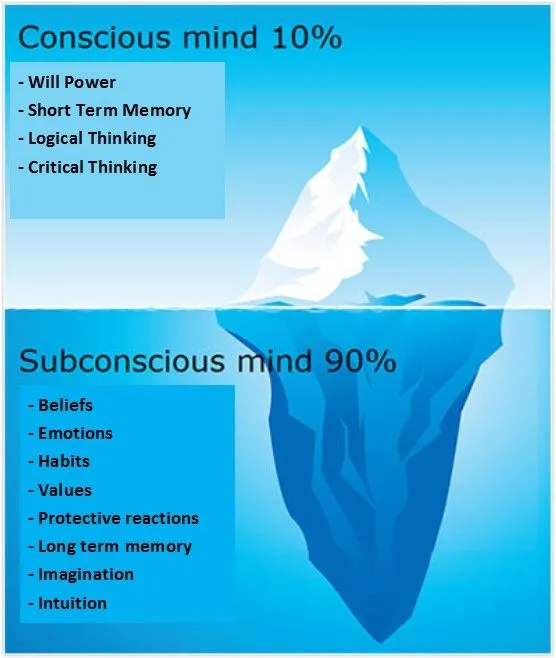

You must have often encountered someone, if you help him find a solution to get out of poverty, he will find many reasons that he can't do it.

The people mentioned are 100% sure you have encountered in a lower economic situation. But how can such simple words become a person's character and be embedded in his mind forever without realizing it?.

## The subconscious interprets it

It turns out that psychologists found that pessimistic words that often come out of your mouth, will be unconsciously interpreted by the subconsciousness.

In this case, 90% of the brain works in subconsciousness, this varies from memories, habits, thinking patterns, mindset, beliefs, and emotions. The other 10% is related to cognitive things like critical thinking, logic, and decision-making.

## How this inferior mentality can happen

Environment and education play a big role in shaping this inferior mentality. And the truth is that humans will always seek justification for the behavior they do, regardless of whether the behavior is wrong or right.

In a friendship, one must have the same mentality as at least 3 other friends. Therefore, if you have 4 ambitious friends, then you are bound to be ambitious too as long as you are friends with them.

In addition to the scope of friendship, parental upbringing is also very influential on this, you may be influenced by the mindset of your parents, besides that the way they educates also affects your character. A person who cannot make decisions and take responsibility is usually very spoiled by his parents as a child.

## How to get out of this mentality

There are many ways to get rid of this inferior mentality, the only goal is to gain *positive optimism*. What are some of the ways that you can achieve this *positive optimism*?.

### Read

Read more literature about self-improvement, and use the key points in the book as your justification tool, you will unconsciously become more positive in dealing with problems.

### Exercise

It goes without saying, but exercise is the best way to build positive discipline and benefits your body and mental health when you do it regularly. Start with a light 10-minute session a day and be consistent.

### Avoid Impossible

When it comes to believing whether you can do it or not, never say "*impossible*", you have to find alternative words, for example: "*I will try*...", "*I will make sure*...".

Take out the word "*impossible*" if you have a solid reason why it's impossible for you to do that.

### Never be pessimistic about your opinion

Ketika berpendapat/beropini, jangan dimulai dengan kata "*maaf*", karena kamu memiliki sebuah opini dan sudah pasti opini tersebut bisa dibantah oleh siapapun, tidak ada yang namanya opini absolut karena setiap orang memiliki opini sendiri yang berbeda-beda.

Ketika opinimu "dikalahkan" oleh seseorang, jangan kurang pede dan malu akan hal itu. Jadikan omongan orang tersebut sebagai bahan evaluasi dan improvisasi diri.

### Stop Labeling Yourself

Never say bad things about yourself. If you realize you have something bad in you, try to change it. Maybe another new bad thing will come to you and so on, you'll never be done.

No matter how good you are, there will always be people who see you as bad.

> Because no one is perfect.

### Keep Learning

Continue to learn about everything from other people as well as literature or media, assert yourself that you are thirsty for knowledge. But remember, don't be too greedy. If you are too greedy, you won't gain knowledge properly.

If you do the above for 3 years or more, I can guarantee that you will get out of that pesky mentality.