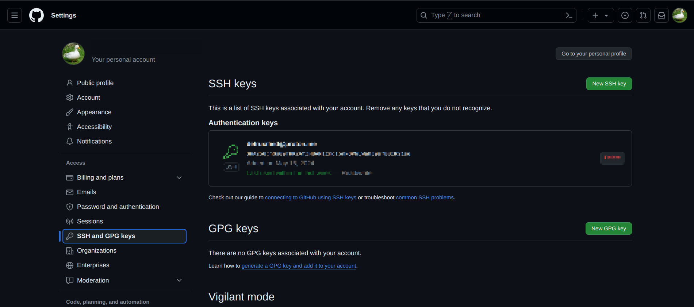

Menggunakan SSH di GitHub dan untuk setiap operasinya kedepan, eliminasi input username dan password.

### Generate SSH Key di device

```plain
> ssh-keygen -t rsa -b 4096 -C "github_email"
```

Skip (Enter) jika diminta “Enter a file in which to save the key”. Berikan passphrase yang mudah di ingat sehari-hari.

Key yang digenerate tersimpan di `~/.ssh` sebagai `id_rsa` dan `id_rsa.pub`

### Jalankan SSH agent

```plain
> eval "$(ssh-agent -s)"
> ssh-add ~/.ssh/id_rsa
```

### Tambahkan key ke GitHub

Jika menggunakan X11
```plain
> xclip -sel clip < ~/.ssh/id_rsa.pub
```

Jika menggunakan Wayland
```plain
> cat ~/.ssh/id_rsa.pub | wl-copy
```

Tambahkan SSH Key melalui menu **SSH and GPG keys** di GitHub.



## KDE Users

Gunakan KDE Wallet untuk mempermudah hidupmu. Normalnya jika steps diatas sudah dijalankan, SSH masih meminta passphrase setiap kali sesi remote dijalankan (git push, etc...).

KDE Wallet akan menyimpan passphrase yang kamu masukkan di awal login untuk dipakai seterusnya selama sesi login berjalan, jadi kamu hanya perlu memasukkan passphrase sekali per sesi user.

Sebelum itu kamu perlu `ksshaskpass` dan KDE Wallet terinstall di sistem.

Tambahkan dibawah ini di file rc seperti `.bashrc`, `.bash_profile`, `.xinitrc` atau sejenisnya:
```bash
# need to setup ask pass even if not using a terminal
# as is the case when KDE is logging in
if [ -e "${SSH_ASKPASS:=/usr/bin/ksshaskpass}" ]
then
    export GIT_ASKPASS=${SSH_ASKPASS}
    export SSH_ASKPASS
fi
```

Buat file script `bebas_namanya.sh` di home ataupun direktori startup script:
```bash
#!/bin/bash
ssh-add ~/.ssh/id_rsa </dev/null
```

Lalu tambahkan script tersebut di autostart (di menu system settings). Setelah itu prompt GUI KDE Wallet akan menyuruhmu memasukkan passphrase sekali setiap user login.