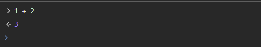

REPL adalah kepanjangan dari **Read Evaluate Print Loop**. Dalam pemrograman hal ini sering dijumpai di antarmuka CLI seperti console atau terminal.

Di Browser:

Browser menggunakan JavaScript, mesin JavaScript yang ada di browser akan:

1. **Read**, menunggu input dari user untuk dievaluasi nantinya.
2. **Eval**, mengevaluasi input, dalam hal ini `1 + 2` adalah `3`.
3. **Print**, mencetak hasil evaluasi, yaitu: `3`.
4. **Loop**, mengulangnya lagi, menunggu input dari user lagi dan seterusnya.

Tidak hanya JavaScript, hal ini bisa juga berlaku dalam beberapa bahasa lainnya seperti Python, Bash, PowerShell dan lain-lain.