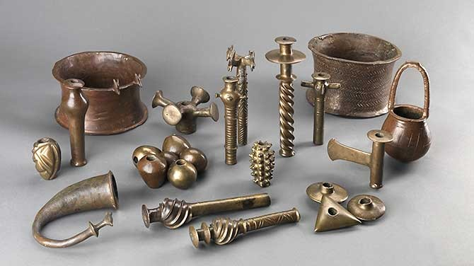

The [Chalcolithic](https://en.wikipedia.org/wiki/Chalcolithic)(5000SM - 3000SM) was a transitional period between the Neolithic and the Bronze Age.

The name itself is derived from the combination of `chalco` Greek for copper and `lithic` meaning stone. Describing that this era humans also still acquired stones in addition to their copper tools.

## Why copper is an option

")

The strongest assumption as to why humans chose copper over others is that copper is more readily available on the surface and copper is also easier to mold and recycle into other forms.

But it should be noted that before the widespread use of copper, humans had also experimented with lead (Pb) with the discovery of lead flakes dating back to the [Halaf period](https://en.wikipedia.org/wiki/Halaf_culture), located at [Yarim Tepe](https://en.wikipedia.org/wiki/Yarim_Tepe).

## The spread of copper smelting

Many archaeological finds of smelters are found around the Balkans at Butmir, Vinča, Varna, Karanovo, and Hamangia. earliest evidence of smelting found in Serbia, in the region of Majdanpek, Jarmovac, and [Pločnik](https://en.wikipedia.org/wiki/Plo%C4%8Dnik_(archaeological_site)).

In the Middle East, the documented discovery is at [Tell Maghzaliyah](https://en.wikipedia.org/wiki/Tell_Maghzaliyah) in the Nineveh region of Iraq.

 
## Hype about copper tools and their social effects
 
In this short period, there were no significant developments other than the acquisition of copper (although the discovery of copper was significant). Social life was not as drastically different as before.

It's just that the tools that were made had begun to take shape very clearly and *aesthetically* functionally. Humans made copper as the head of the tool and stone or wood as the handle of the tool.

Social stratification began to be complex and developed, for example, the culture of the Ubaid period which later developed as the population increased, became the Uruk period and eventually become the first complex civilization, the Sumerian Civilization.

This complexity was also influenced by various factors, one of which was that new technologies such as copper increased the demand for new, related and more specialized occupations.

## What effect did the use of copper have on mankind

Humans are curious creatures, and their curiosity about copper led to the discovery of bronze. Bronze is a combination of tin and copper that they discovered unexpectedly. This gave birth to the bronze age and will continue to create new innovations with similar patterns.