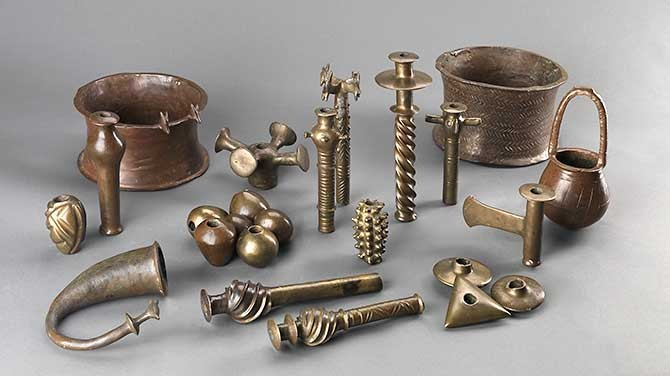
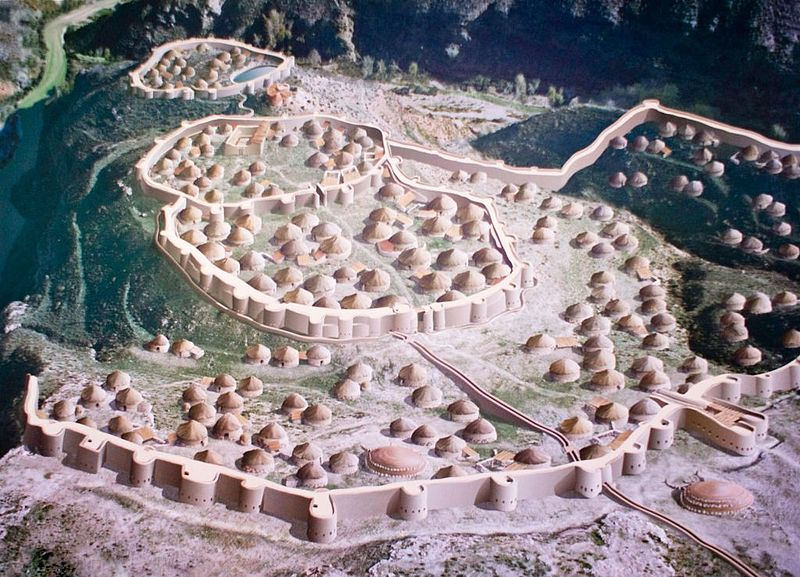

[Chalcolithic](https://en.wikipedia.org/wiki/Chalcolithic) (5000SM - 3000SM) adalah periode transisi antara zaman Neolithic ke zaman Perunggu.

Namanya sendiri berasal dari gabungan `chalco` bahasa yunani yang artinya tembaga dan `lithic` yang artinya batu. Menggambarkan kalau zaman ini manusia juga masih mengakuisisi batu disamping peralatan berbahan tembaganya.

## Mengapa tembaga menjadi pilihan

")

Asumsi terkuat mengapa manusia memilih tembaga dibanding yang lain adalah ketersediaan alam tembaga lebih banyak dipermukaan dan tembaga juga lebih mudah dibentuk dan didaur ulang menjadi bentuk lain.

Tapi perlu dicatat bahwa sebelum pemakaian tembaga meluas, manusia juga telah bereksperimen terhadap timbal (Pb) dengan ditemukannya serpihan timbal yang berasal dari periode [Halaf](https://en.wikipedia.org/wiki/Halaf_culture), letaknya di [Yarim Tepe](https://en.wikipedia.org/wiki/Yarim_Tepe).

## Penyebaran peleburan tembaga

Penemuan arkeologi smelter banyak ditemukan sekitaran Balkan yaitu di Butmir, Vinča, Varna, Karanovo, dan Hamangia, ada juga di Serbia sebagai bukti paling awal dari peleburan ini yaitu Majdanpek, Jarmovac dan [Pločnik](https://en.wikipedia.org/wiki/Plo%C4%8Dnik_(archaeological_site)).

Di timur tengah, penemuan terdokumentasi berada di [Tell Maghzaliyah](https://en.wikipedia.org/wiki/Tell_Maghzaliyah) di kawasan Nineveh, Iraq.

## Hype akan alat tembaga dan efeknya terhadap sosial

Di periode yang pendek ini, tidak ada perkembangan yang signifikan selain akuisisi tembaga (walaupun penemuan tembaga termasuk sangat signifikan). Kehidupan sosial tidak ada perbedaan drastis seperti sebelumnya.

Hanya saja peralatan yang dibuat sudah mulai terbentuk sangat jelas dan *aesthetic* secara fungsional. Manusia menjadikan tembaga sebagai "mata" utama peralatannya dan batu atau kayu sebagai *handle* atau pegangan dari alat tersebut.

Stratifikasi sosial mulai kompleks dan berkembang, contohnya kebudayaan periode Ubaid yang nantinya berkembang seiring bertambahnya populasi, menjadi periode Uruk dan akan menjadi sebuah peradaban kompleks pertama yaitu Peradaban Sumeria.

Kompleksitas ini juga dipengaruhi oleh berbagai faktor salah satunya teknologi baru seperti tembaga meningkatkan permintaan akan pekerjaan-pekerjaan baru yang berkaitan dan lebih spesialis.

## Apa pengaruh penggunaan tembaga ini terhadap umat manusia

Manusia adalah makhluk penasaran, rasa penasaran mereka akan tembaga melahirkan penemuan baru, yaitu perunggu. Perunggu merupakan gabungan antara timah dan tembaga yang mereka temukan secara tidak diduga. Hal ini melahirkan zaman perunggu dan akan terus menciptakan inovasi penemuan baru seterusnya dengan pola yang mirip.