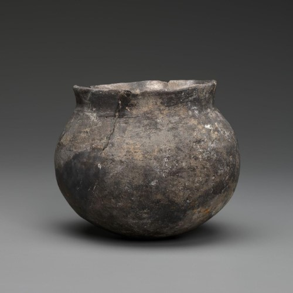

The Mesolithic is a transitional period between the Paleolithic and Neolithic. This period is characterized by a slow transformation from hunter-gatherer life to sedentary settlement.

The Mesolithic has a different time span in different regions. In the east, especially the Fertile Crescent, this period occurs at c. 20kya - c. 10kya while in Europe it occurs at c. 15kya - c. 5kya.

## What happens during this time?

### Mobility

Humans still live semi-nomadic lives, but as social skills become more complex, humans are more likely to live in large groups and choose to stay longer in areas with abundant natural resources.

Permanent settlements can be found on the shores or swamps due to the guarantee of natural resources from abundant water.

### Post ice age period

During this time there was a global decline in sea water as the end of the [last glacial maximum](https://en.wikipedia.org/wiki/Last_Glacial_Maximum). Warmer temperatures and melting ice cap open up lucrative opportunities for humans to exploit more marine resources.

As result, more advanced settlements tend to live on the coast.

### Pottery founded

Archaeological discoveries also prove that pottery was used before the agricultural revolution. Pottery during this time was not durable because of the firing technique and it could be that they burned at a relatively low temperature.

Pottery was very influential on mobility, because at that time they needed more inventory for more looting. Pottery also expand their nutrition and diet by cooking.

Maybe they were making soup earlier in those days? Who knows...

## After this period

Right after this period, the agricultural revolution took place. The lifestyle of the majority of people changed to sedentary, and became a settlement with a more complex government system than before.