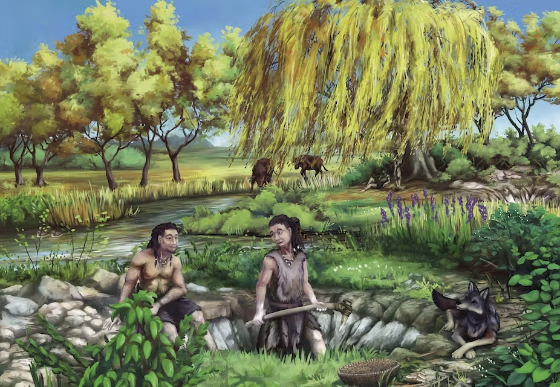
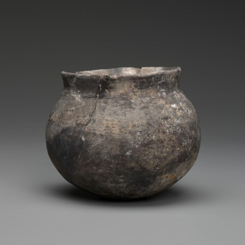

Mesolithic adalah periode transisi antara paleolithic dan Neolithic. Periode ini ditandai oleh transformasi perlahan dari kehidupan hunter-gatherer menjadi pemukiman menetap.

Mesolithic memiliki rentang waktu yang berbeda di berbagai wilayah. Di timur khususnya hilal subur, periode ini terjadi pada c. 20kya – c. 10kya sedangkan di Eropa terjadi pada c. 15kya – c. 5kya.

## Apa yang terjadi pada periode ini?

### Mobilitas

Manusia masih menjalani kehidupan semi-nomaden, namun seiring kompleksnya kemampuan sosial, manusia lebih cenderung hidup dalam satu kelompok besar dan memilih tinggal lebih lama di daerah dengan sumber daya alam yang melimpah.

Pemukiman yang permanen bisa ditemukan di pesisiran sungai atau rawa dikarenakan jaminan sumber daya alam dari air yang melimpah.

### Akhir Dari Zaman Es

Pada masa ini terjadi penurunan air laut secara global sebagai akhir dari [last glacial maximum](https://en.wikipedia.org/wiki/Last_Glacial_Maximum).
Suhu yang hangat dan mencairnya es membuka peluang <abbr title="untung besar">gacor</abbr> bagi manusia untuk mengeksploit sumber daya laut yang lebih banyak lagi.

Pada akhirnya pemukiman yang makmur cenderung tinggal di pesisir.

### Tembikar Ditemukan

Penemuan arkeologi juga membuktikan bahwa tembikar sudah dipakai sebelum revolusi agrikultur. Tembikar dimasa ini tidak tahan lama karena  teknik pembakarannya dan bisa jadi mereka membakar di suhu yang relatif rendah.

Tembikar sangat berpengaruh terhadap mobilitas, karena pada masa itu mereka perlu <abbr title="tampungan">inventory</abbr> yang lebih banyak untuk <abbr title="mengumpulkan barang">looting</abbr> yang banyak. Tembikar juga mempeluas variasi nutrisi dan diet mereka dengan memasak. 

Mungkin pada masa itu mereka sudah membuat sup lebih awal? Who knows...

## Sesudah periode ini

Tepat sesudah periode ini, revolusi agrikultur terjadi. Pola hidup manusia mayoritas berubah menjadi menetap, dan menjadi sebuah pemukiman dengan sistem pemerintahan yang lebih kompleks dari sebelumnya. 
