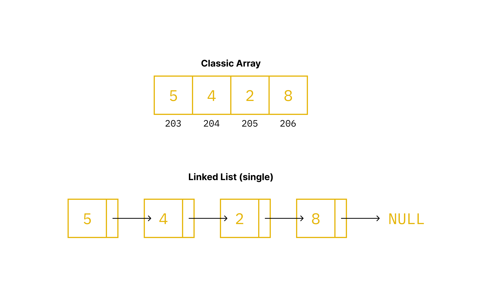
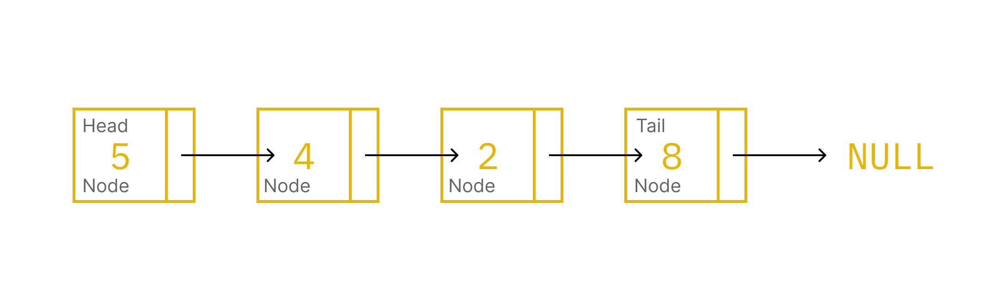

Linked list adalah bentuk koleksi data fleksibel lawan dari array. Bentuk koleksi linked list lebih rumit daripada array namun lebih fleksibel daripada array.

Jika array menyimpan data dalam blok memori yang bersifat consecutive/contiguous dan static. Maka linked list menyimpan data dalam bentuk linked seperti tautan dan fleksibel.




## Struktur Linked List

Linked list memiliki struktur:



- **Node**, Sebuah element pada linked list
- **Head**, Kepala/node pertama pada lists
- **Tail**, Ekor/node terakhir pada lists, ekor akan selalu mengarah ke `NULL` untuk node berikutnya.

Node pertama secara otomatis menjadi kepala sekaligus ekor jika dia cuma satu-satunya node di list tersebut.

## Membuat struct untuk node

Node disimpan dalam sebuah data object berbentuk struct.

```c
typedef struct Node
{
  int data;
  struct Node* next;
} Node;
```

`struct Node` akan menyimpan:

- `data`, actual data didalam element tersebut.
- `next`, sebuah pointer yang menyimpan alamat node beriNode* list;
list = NULL;kutnya.

## Deklarasi

Deklarasi variable untuk pointer Node harus diawali dengan `NULL`. Ini artinya belum ada satupun node yang dibuat di variable pointer tersebut.

```c
Node* list;
list = NULL;
```

## Menambah node

Simplenya untuk menambah node pertama, kita cukup membuat alokasi memori untuk node tersebut dan menambah nilai yang sesuai didalamnya.

```c
Node* list;
list = NULL;

list = malloc(sizeof(Node));
list->data = 5;
list->next = NULL;
```

Untuk menambah node di element berikutnya, kita harus mengganti `next` pada element sebelumnya (tail/ekor) menjadi node baru yang akan dibuat.

```c
Node* list;
list = NULL;

list = malloc(sizeof(Node));
list->data = 5;
list->next = NULL;
list->next = malloc(sizeof(Node));
list->next->data = 4;
list->next->next = NULL;
```

Dan seterusnya.

## Fungsi untuk menambah node baru

Mengulangi kode diatas secara manual akan membuang-buang waktu dan tidak sesuai dengan prinsip DRY pada umumnya, alangkah lebih baik jika kita membuat fungsi yang akan menambah node baru di ujung node.

### Prototype

```c
void add_node(Node** root, int data);
```

- `Node** root` meminta alamat dari alamat yang menyimpan `root` sebagai argument, dalam hal ini argument adalah `&list`. `Node** root` berbeda dengan `Node* root` yang merupakan alamat dari node `root`, bukan alamat yang menyimpan alamat dari `root`.

- `int data` adalah actual data dari node.

### Definition

```c
void add_node(Node** root, int data)
{
  Node* new = malloc(sizeof(Node));
  new->data = data;
  new->next = NULL;
}
```

Lalu setelahnya kita menggunakan `if else` statement untuk menentukan apakah node sudah ada isinya atau belum. Jika saat ini node adalah `NULL` maka `new` akan menjadi kepala dari list.

Sebaliknya jika sudah ada isinya, maka kita harus mencari kepala dari list, lalu mengubah pointer dari `next` yang ada di kepala list tersebut. `next` yang baru akan mengarah ke memori yang baru saja dialokasikan untuk `new`.

```c
void add_node(Node** root, int data)
{
  Node* new = malloc(sizeof(Node));
  new->data = data;
  new->next = NULL;

  if (*root == NULL)
  {
    *root = new; // *root adalah kepala dari list
  }
  else
  {
    /* mencari ekor */
    Node* tail;
    tail = *root;
    while (tail->next != NULL)
    {
      tail = tail->next;
    }
    /* assign new ke tail->next */
    tail->next = new;
  }
}
```

#### Penjelasan mencari ekor

```c
/* mencari ekor */
Node* tail;
tail = *root;
while (tail->next != NULL)
{
  tail = tail->next;
}
```

`tail` akan terus travese node ke node sampai nilai `next` dari node adalah `NULL`, yang artinya `tail` akan selalu berakhir di node terakhir/ekor dalam perulangan ini.

### Penggunaan

Di `main()`, kita hanya perlu memanggil fungsi dengan argument dan tipe data yang diinginkan.

```c
typedef struct Node
{
  int data;
  struct Node* next;
} Node;

void add_node(Node** root, int data);

int main(int argc, char** argv)
{
  Node* list;
  list = NULL;

  add_node(&list, 5); // Menambah node (as head) dengan value 5
  add_node(&list, 4); // Menambah node dengan value 4
  add_node(&list, 2); // Menambah node dengan value 2
  add_node(&list, 8); // Menambah node (as tail) dengan value 8

  return 0;
}
```

Atau, cara yang lebih sophisticated lagi menggunakan `for` loop.

```c
int main(int argc, char** argv)
{
  Node* list;
  list = NULL;

  int r[] = {5, 4, 2, 8};
  int n = sizeof(n)/sizeof(n[0]);

  for(int i = 0; i < n; i++)
  {
    add_node(&list, r[i]); // Menambah node sesuai dengan element array berurut
  }

  return 0;
}
```