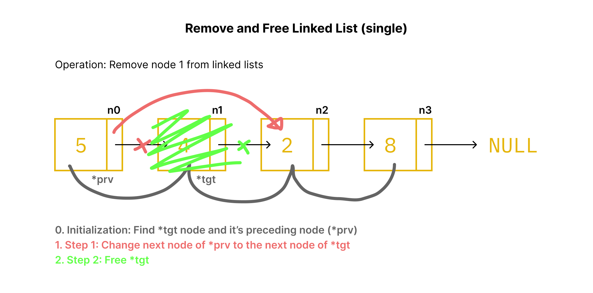

Lanjutan dari linked list sebelumnya, kali ini kita akan menghapus dan membebaskan node dari linked list.

Overview dari operasi menghapus node cukup mudah, kita hanya memerlukan **target** node yang ingin dihapus dan node sebelumnya dari **target** node. Berdasarkan diagram dibawah ini...



Kita perlu:

1. Mencari `*tgt` sebagai node yang ingin dihapus dan mencari `*prv` sebagai node sebelum `*tgt`.
2. Ubah node selanjutnya dari `*prv` menjadi node selanjutnya dari `*tgt`.
3. Membebaskan `*tgt` dari heap dengan `free`.

## Prototype fungsi

```c
void delete_node(Node** root, int pos);
```

Dimana:
- `Node** root` adalah alamat dari alamat node pertama. Pass `&root` sebagai argument jika `root` adalah `Node* root`.
- `int pos` adalah posisi dari node yang ingin dihapus, Pass `0` sebagai argument jika ingin menghapus node pertama dan seterusnya.

## Definition

Pertama, mencari `*tgt` dan `*prv` berdasarkan `pos` melalui for loop yang mekanismenya mirip dengan mencari ekor lists. `*tgt` akan diawali oleh `NULL` untuk mengindikasikan `*tgt` adalah node pertama (`*root`) atau bukan.

```c
void delete_node(Node** root, int pos)
{
  Node* prv = NULL;
  Node* tgt = *root;
  for (int i = 0; i != pos; i++)
  {
    prv = tgt;
    tgt = tgt->next;
  }
}
```

Jika argument `pos` adalah `0` maka akan mengabaikan perulangan tersebut dan langsung menuju ke statement penggantian pointer `next`.

Bagaimana cara kita tahu `*tgt` sebagai node pertama adalah dengan melakukan validasi `*prv`, jika `*prv == NULL` maka `*tgt` adalah node pertama, dengan kata lain `*tgt == *root`.

```c
if (*prv == NULL)
{
  *root = tgt->next;
  free(tgt);
}
```

Statement diatas langsung mengganti `*root` menjadi `tgt->next`, yang merupakan node setelah `tgt`, lalu membebaskan `tgt` dari heap.

Penggantian `*root` hanya berlaku jika `pos == 0` atau node adalah node pertama. Sekarang operasi jika `*prv` memiliki nilai atau `pos > 0`.

```c
if (*prv == NULL)
{
  *root = tgt->next;
  free(tgt);
}
else
{
  prv->next = tgt->next;
  free(tgt);
}
```

Statement pada blok `else` akan melakukan prosedur sesuai dengan diagram awal.

## Full Code

```c
void delete_node(Node** root, int pos)
{
  Node* prv = NULL;
  Node* tgt = *root;
  for (int i = 0; i != pos; i++)
  {
    prv = tgt;
    tgt = tgt->next;
  }

  if (*prv == NULL)
  {
    *root = tgt->next;
    free(tgt);
  }
  else
  {
    prv->next = tgt->next;
    free(tgt);
  }
}
```