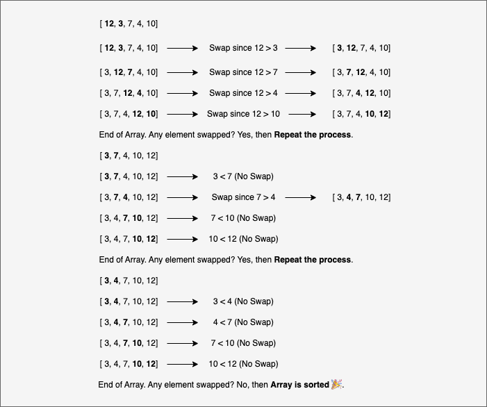

Bubble sort adalah algoritma sortir simpel yang cara kerjanya adalah menggeser element paling besar/kecil ke ujung array. Dengan cara membandingkan elemen disampingnya, jika elemen disampingnya lebih besar/kecil daripada elemen saat ini, maka akan menggeser elemen tersebut sehingga elemen-elemen tersebut memiliki urutan dari terkecil sampai terbesar atau sebaliknya.





Bubble sort mudah untuk diimplementasikan, namun intensif sumber daya jika diaplikasikan untuk dataset besar.

## Implementasi di C

Cara mudah mengimplementasikan bubble sort di C adalah dengan tahap:

1. Buat sebuah `bool` sebagai pengawas perulangan sepanjang penyortiran.
2. Buat sebuah perulangan `for` yang akan mengulang sortir sebanyak `length-1` pengulangan.
3. Buat sebuah perulangan `for` didalam `for` yang akan meng-iterate `array` yang dibuat.
4. Dalam iterasi `for` tersebut, jika komparasi `element[i]` dan `element[i+1]` memenuhi syarat, maka nilainya akan saling menukar, mentrigger `bool` untuk terus mengkomparasi `element` per `element` sampai tidak ada lagi yang bisa di komparasi, alias `bool` adalah `false`.

### Buat sebuah boolean sebagai pengawas perulangan

Membuat variable tipe data `boolean` sebagai pengawas perulangan, `boolean` ini yang akan memberi keputusan kapan perulangan harus berhenti atau tidak, perulangan atau program secara keseluruhan akan berakhir jika status `boolean` terahir adalah `false`.

```c
#include <stdio.h>
#include <stdbool.h>

void bsort(int array[], int length) {
  bool swapped;
}
```

Variable `swapped` akan mengawasi perulangan dan keseluruhan program.

### Buat perulangan for loop untuk mengulangi sortir sebanyak length-1 kali

Buat for loop yang akan terus mengulang selama `length-1` kali.

```c
#include <stdio.h>
#include <stdbool.h>

void bsort(int array[], int length) {
  bool swapped;
  for (int i = 0; i < length-1; i++)
  {
    // ...
  }
}
```

### Iterate array dengan perulangan for

Element-element didalam array akan dikomparasi didalamnya.

```c
#include <stdio.h>
#include <stdbool.h>

void bsort(int array[], int length) {
  bool swapped;
  for (int i = 0; i < length-1; i++)
  {
    swapped = false;
    for (int j = 0; j < length-i-1; j++)
    {
      // ...
    }
  }
}
```

Jika kamu `print("%d \n")` setiap perulangan seperti dibawah ini:

```c
  for (int i = 0; i < length-1; i++)
  {
    printf("->%d\n", i)
    swapped = false;
    for (int j = 0; j < length-i-1; j++)
    {
      printf("  ->%d\n", i)
    }
  }
```

Maka hasil dari `bsort(array, 5)` akan seperti ini:

```
-> 0
  -> 0
  -> 1
  -> 2
  -> 3
-> 1
  -> 0
  -> 1
  -> 2
-> 2
  -> 0
  -> 1
-> 3
  -> 0
```

Pengulangan sesuai dengan diagram dan visual di awal artikel ini, didalamnya nanti sub-pengulangan akan menggeser element paling besar ke kanan jika `array[j] > array[j+1]`.

### Komparasi element jika memenuhi syarat komparasi

Komparasi element adalah pembanding lebih besar `>` atau lebih kecil `<`. Umumnya bubble sort akan komparasi element paling besar `>` untuk digeser ke ujung.

Misalkan dalam `[3, 1, 2]`, jika `3 > 1` maka akan menukar `3` di posisi `1`, dan di iterasi kedua akan menukar `3` yang ada di posisi `1` tersebut (`[1, 3, 2]`) di posisi `2`. Kita tidak perlu komparasi elemen terakhir yaitu `3` karena tidak ada lagi pembandingnya `[1, 2, 3]`.

```c
void bsort(int array[], int length) {
  bool swapped;
  for (int i = 0; i < length-1; i++)
  {
    swapped = false
    for (int j = 0; j < length-i-1; j++)
    {
      if (array[i] > array[i+1])
      {
        int temp = array[i];
        array[i] = array[i+1];
        array[i+1] = temp;
        swapped = true;
      }
    }
    if (swapped == false) break;
  }
}
```

Perulangan akan terus berjalan ketika `swapped` adalah `true`. Maka kita perlu menghentikannya ketika tidak ada lagi yang bisa dikomparasi dengan `swapped == false` di akhir perulangan luar.

## Full code

```c
#include <stdio.h>
#include <stdbool.h>

void bsort(int array[], int length) {
  bool swapped;
  for (int i = 0; i < length-1; i++)
  {
    swapped = false
    for (int j = 0; j < length-i-1; j++)
    {
      if (array[i] > array[i+1])
      {
        int temp = array[i];
        array[i] = array[i+1];
        array[i+1] = temp;
        swapped = true;
      }
    }
    if (swapped == false) break;
  }
}

int main() {
  int array[] = {21, -3, -15, 12, 8, 3, 9, 18};
  int length = sizeof(array) / sizeof(array[0]);

  bsort(array, length);

  for (int i = 0; i < length; i++)
  {
    printf("%d ", array[i]);
  }
  
  return 0;
}
```