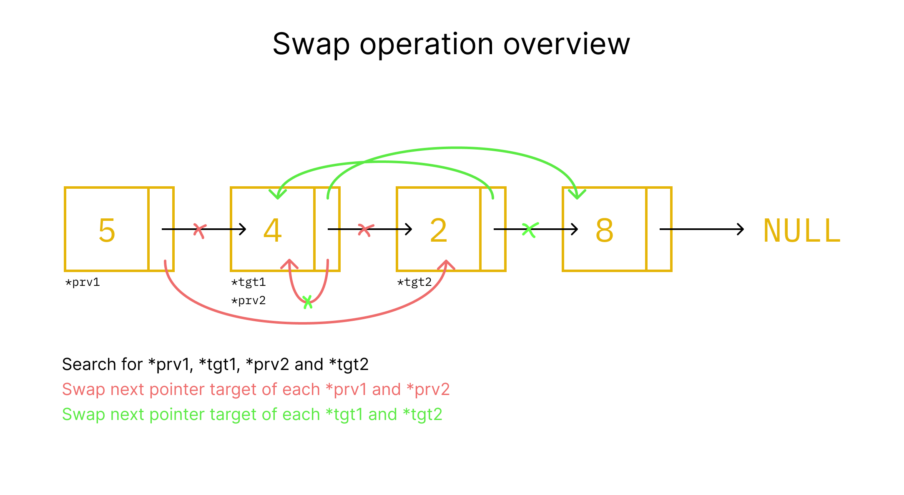
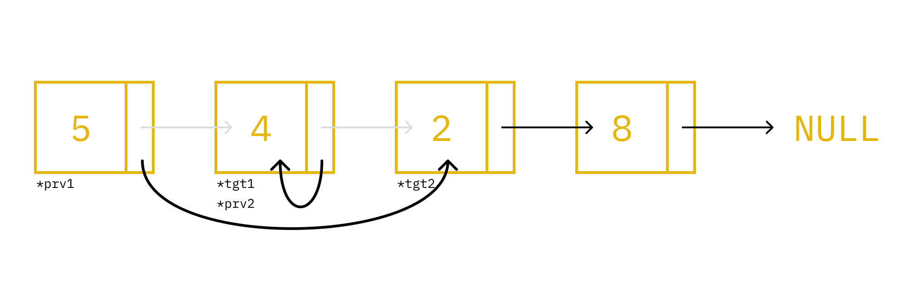
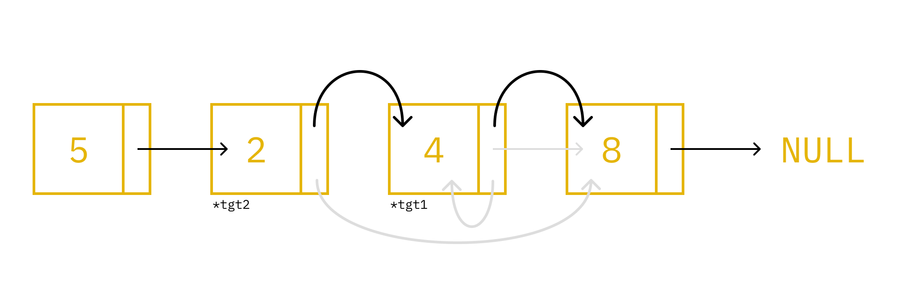

Ide menukar antar node di linked list, hampir serupa dengan operasi delete node tapi tidak sampai menghapus nodenya.

Kita hanya perlu mengganti next node pada `tgt1` dan sebelum `tgt1`, sebalinknya lakukan juga pada `tgt2` dan sebelumnya.



Diagram diatas akan menukar 4 dan 2.

## Prototype

```c
void swap_node(Node** root, Node* node1, Node* node2);
```

Dimana:
- `Node** root` adalah alamat dari alamat dari struct `root`.
- `Node* node1` alamat dari node pilihan pertama atau `tgt1`.
- `Node* node2` alamat dari node pilihan kedua atau `tgt2`.

## Definition

Deklarasi `prv` dan `tgt` sebagai element sebelum target dan target itu sendiri di masing masing node.

```c
void swap_node(Node** root, Node* node1, Node* node2)
{
  Node *prv1, *tgt1, *prv2, *tgt2, *nx;
  prv1 = tgt1 = prv2 = tgt2 = NULL;
  nx = *root;
}
```

### Mencari target node

Kita akan mencari node dari `node1`/`node2` dan node sebelumnya.

```c
void swap_node(Node** root, Node* node1, Node* node2)
{
  Node *prv1, *tgt1, *prv2, *tgt2, *nx;
  prv1 = tgt1 = prv2 = tgt2 = NULL;
  nx = *root;

  while (nx != NULL)
  {
    if (nx == node1) tgt1 = nx;
    if (nx == node2) tgt2 = nx;

    if(nx->next && nx->next == node1) prv1 = nx;
    if(nx->next && nx->next == node2) prv2 = nx;

    nx = nx->next;
  }
}

```

Lihat artikel [sebelumnya](../22-07-2024-linked-list-1/#penjelasan-mencari-ekor) untuk mengerti cara kerja perulangan `nx`.

### Menukar next node dari node sebelumnya

`prv1` dan `prv2` adalah node sebelum `node1`/`tgt1` dan `node2`/`tgt2`. Kita harus menukar next node dari setiap `prv` hingga menjadi seperti ini:



**Apa yang terjadi pada `prv2` ?** Hal unik tersebut terjadi ketika `prv2` dan `tgt1` berada pada node yang sama. Hal ini selalu terjadi jika menukar node dengan node yang ada disampingnya.

```c
void swap_node(Node** root, Node* node1, Node* node2)
{
  /*...*/

  if (prv1 == NULL)
    *root = tgt2;
  else
    prv1->next = tgt2;

  if (prv2 == NULL)
    *root = tgt1;
  else
    prv2->next = tgt1;
}
```

Hal unik terjadi pada `tgt1`, dimana dia tertuju ke dirinya sendiri. Ini artinya `tgt1->next == tgt1` dan hal ini wajar berdasarkan yang dialami `prv2` tadi.

### Menukar next node dari node target

Menukar next node dari `tgt1` dan `tgt2` sehingga menjadi seperti ini:



```c
void swap_node(Node** root, Node* node1, Node* node2)
{
  /*...*/

  Node* tmp = tgt1->next;
  tgt1->next = tgt2->next;
  tgt2->next = tmp;
}
```

Kode diatas, `tmp` menyimpan `tgt1->next` secara *temporary* (ingat `tgt1->next == tgt1`). Setelahnya `tgt1->next` diubah menjadi `tgt2->next` atau `tgt1->next` mengarah ke node terakhir sesuai diagram.

Lalu kita ubah lagi `tgt2->next` mengarah ke `tmp`, yakni `tgt1`. Dengan ini linked list berhasil tersambung lagi posisinya.


### Full Code

```c
void swap_node(Node** root, Node* node1, Node* node2)
{
  Node *prv1, *tgt1, *prv2, *tgt2, *nx;
  prv1 = tgt1 = prv2 = tgt2 = NULL;
  nx = *root;

  while (nx != NULL)
  {
    if (nx == node1) tgt1 = nx;
    if (nx == node2) tgt2 = nx;

    if(nx->next && nx->next == node1) prv1 = nx;
    if(nx->next && nx->next == node2) prv2 = nx;

    nx = nx->next;
  }

  if (prv1 == NULL)
    *root = tgt2;
  else
    prv1->next = tgt2;

  if (prv2 == NULL)
    *root = tgt1;
  else
    prv2->next = tgt1;

  Node* tmp = tgt1->next;
  tgt1->next = tgt2->next;
  tgt2->next = tmp;
}
```