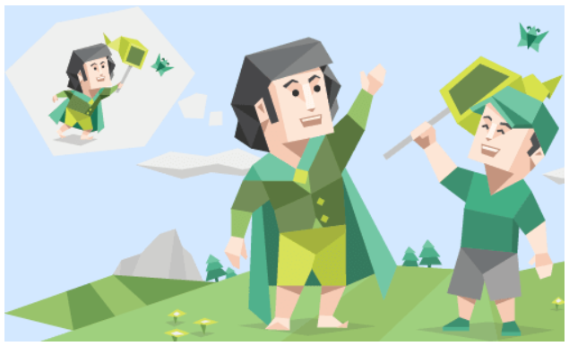
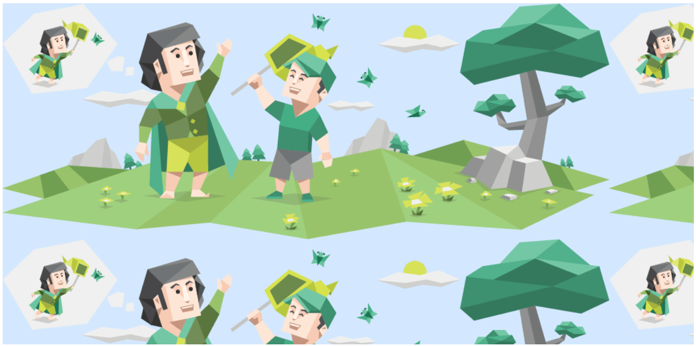

Ada dua jenis gambar yang bisa digunakan ketika membuat gambar dalam webdev, metode element `` seperti yang sebelumnya dan metode `background-image` dari CSS.

`background` yang ada di CSS, tidak bisa dibaca oleh DOM dan juga tidak memiliki pengaruh SEO, ini membuat `background` lebih cocok sebagai gambar untuk background ataupun untuk dekoratif lainnya.

Disini akan menggunakan gambar dan setelan yang sama seperti sebelumnya:

```html
<style>
  body {
    height: 100vh;
    display: flex;
    align-items: center;
  }

  .kotak {
    background-image: url('assets/mbti-5.png');
    margin: 0 auto;
    width: 500px;
    height: 300px;
    background-color: rgb(211, 232, 255);
  }
</style>
<body>
  <div class="kotak"></div>
</body>
```



## Background Repeat

Jika gambar lebih kecil dari container, maka gambar akan direpetisi seperti ubin selagi mempertahankan aspect rationya.

```css
.kotak {
  background-repeat: repeat;
}
```



Atur `background-repeat` menjadi `no-repeat` untuk menghindari pengulangan seperti ini.

## Background Size

`background-size` sama seperti `object-fit` kegunaannya. Tetapi disini `background-size` hanya punya 2 value `contain` dan `cover` yang dua-duanya sama seperti di `object-fit`.


## Background Position

`background-position` sama seperti `object-position` kegunaanya, dan valuenya pun sama juga.


Berbeda dengan `object-position`, nilai default dari `background-position` adalah `0% 0%`