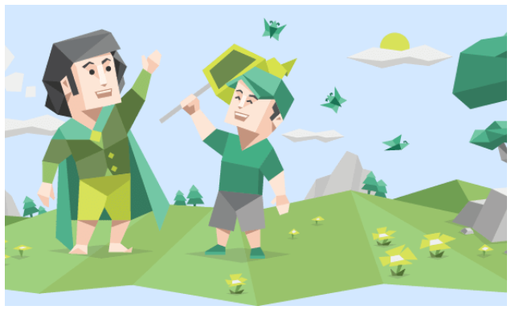
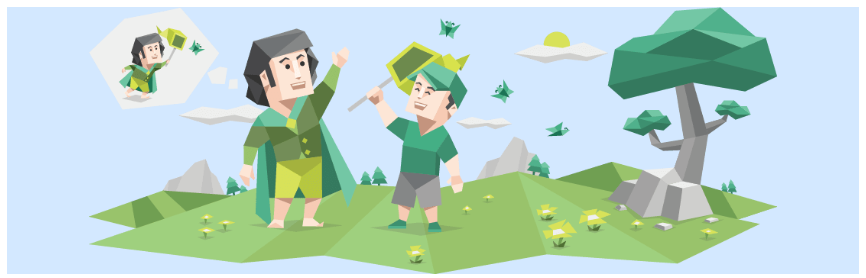
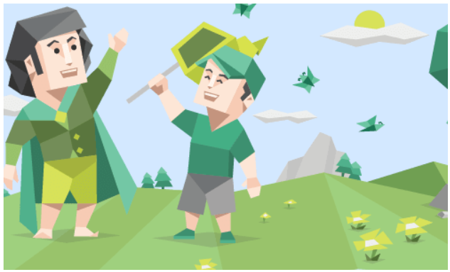
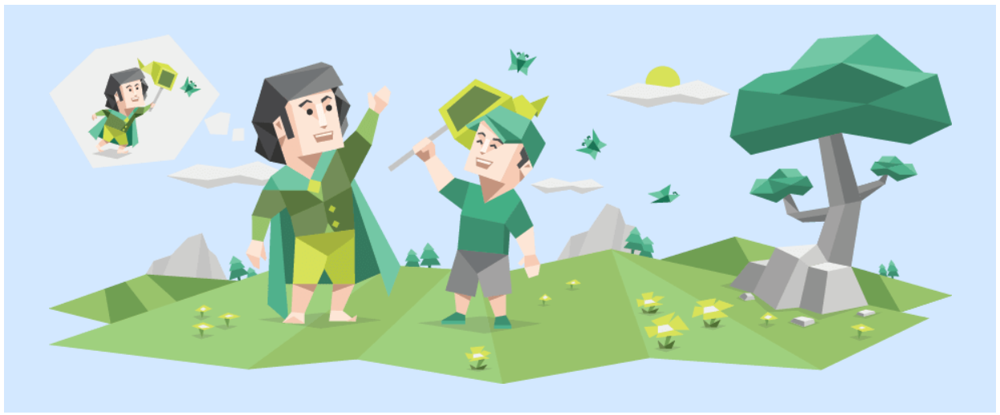

How to deal with your images in CSS that are very difficult to control, ranging from improper proportions, improper image position, svg and so on.

## Object Fit

Object Fit sets how the image proportions are displayed if it exceeds/decreases its container. The default value is `fill` and the remaining 4 will discussed below.

There are 5 `object-fit` values: `fill`, `contain`, `cover`, `scale-down`, and `none`.


### Cover

Maintains the aspect ratio of the image, but also follows the width and height of the container. So if the image is larger than the container, the image will be cropped while maintaining the aspect ratio.

```html
<style>
  .box {
    margin: 0 auto;
    width: 500px;
    height: 300px;
    background-color: rgb(211, 232, 255);
    display: flex;
  }

  .image {
    width: 100%;
    height: 100%;
    object-fit: cover;
  }
</style>
<body>
  <div class="box">
    
  </div>
</body>
```



### Contain

Preserves the aspect ratio of the image, but at the same time makes the entire image fit inside the container. So no matter how the container is enlarged/reduced, the image will always be proportional and inside the container with all its content.

```html
<style>
  .box {
    margin: 0 auto;
    /* Adjust freely */
    width: 500px;
    height: 300px;
    /* Adjust freely */
    background-color: rgb(211, 232, 255);
    /* Try to center the image inside with flex */
    display: flex;
    /* Try to center the image inside with flex */
  }

  .image {
    width: 100%;
    height: 100%;
    object-fit: contain;
  }
</style>
<body>
  <div class="box">
    
  </div>
</body>
```




### None

Preserves the aspect ratio of the image, but does not resize the image at all. This keeps the image in its original size.

The original image is 900px x 350px, this makes the image cropped if the container is smaller than the image size and vice versa.





### Scale Down

`scale-down` is a combination of `none` and `contain`. The image will have the `contain` property if the container is smaller than the image, and will have the `none` property if the container is larger than the image.

This means that the image will *scale down* if the container is smaller, but there is no resizing when the container is larger than the image.

## Object Position

`object-position` sets the part of the image that you want to expose when the image is larger than the frame (in cropped position).

```css
.class {
  object-position: position
}
```

The default values of `object-postion` are: `center center` or `50% 50%`.

### Percentage Values and PX Units

The value 0 (starting point) is above the left of the container, or the exact `object-postion: 0px 0%` is the same as `object-postion: left top`


### Explicit values

The available explicit values are: `left`, `center`, `right`, `top`, and `bottom`. Self explanatory, where these positions are not limited by order of combination.


