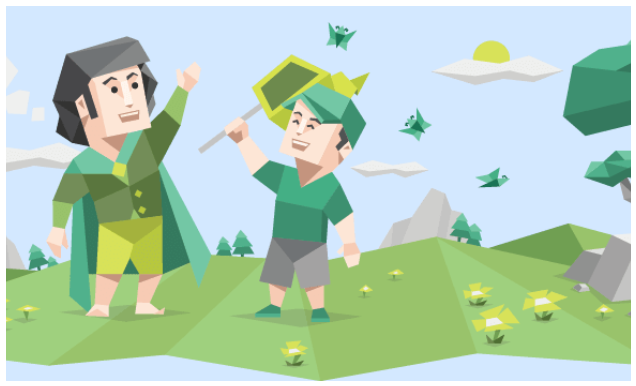
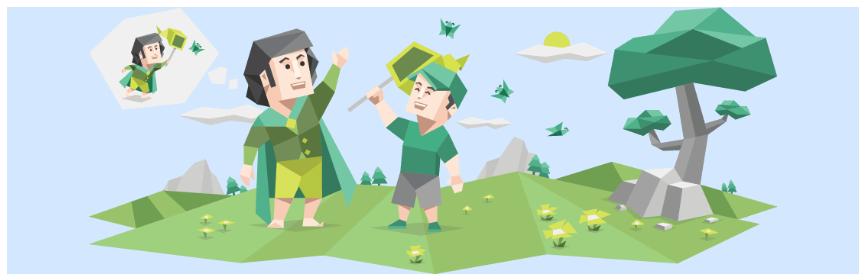
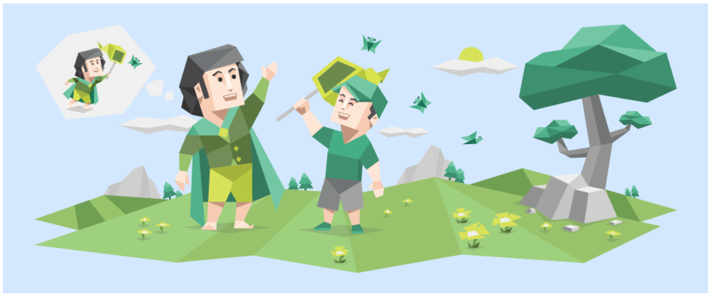

Bagaimana cara menghadapi gambarmu di CSS yang sulit sekali rasanya untuk dikendalikan, mulai dari proporsi tidak sesuai, posisi gambar tidak sesuai, svg dan lainnya.

## Object Fit

Object Fit mengatur bagaimana proporsi gambar ditampilkan jika melebihi/mengurangi kontainernya. Nilai default adalah `fill` dan yang dibahas disini hanya 4 sisanya selain `fill`. 

Value `object-fit` ada 5: `fill`, `contain`, `cover`, `scale-down`, dan `none`.


### Cover

Mempertahankan aspek ratio gambar, tetapi juga mengikuti width dan height dari containernya. Jadi jika gambar lebih besar daripada container maka gambar akan di crop selagi mempertahankan aspek rationya.

```html
<style>
  .kotak {
    margin: 0 auto;
    width: 500px;
    height: 300px;
    background-color: rgb(211, 232, 255);
    display: flex;
  }

  .image {
    width: 100%;
    height: 100%;
    object-fit: cover;
  }
</style>
<body>
  <div class="kotak">
    
  </div>
</body>
```



### Contain

Mempertahankan aspek ratio gambar, tetapi sekaligus membuat keseluruhan gambar akan tetap masuk didalam kontainer. Jadi bagaimanapun caranya container dibesar/kecilkan, gambar akan selalu proporsional dan didalam container semua kontennya.

```html
<style>
  .kotak {
    margin: 0 auto;
    /* Silahkan adjust ukuran sesukamu */
    width: 500px;
    height: 300px;
    /* Silahkan adjust ukuran sesukamu */
    background-color: rgb(211, 232, 255);
    /* flex membuat posisi gambar ditengah (vertikal) */
    display: flex;
    /* flex membuat posisi gambar ditengah (vertikal) */
  }

  .image {
    width: 100%;
    height: 100%;
    object-fit: contain;
  }
</style>
<body>
  <div class="kotak">
    
  </div>
</body>
```



### None

Mempertahankan aspek rasio gambar, tapi tidak mengubah ukuran gambar sama sekali. Ini membuat gambar tetap dalam ukuran aslinya.

Gambar asli berukuran 900px x 350px, ini membuat gambar terpotong jika container lebih kecil daripada ukuran gambar dan sebaliknya.




### Scale Down

`scale-down` adalah gabungan dari `none` dan `contain`. Gambar akan memiliki sifat `contain` jika container lebih kecil daripada gambar, dan akan memiliki sifat `none` jika container lebih besar daripada gambar.

Ini artinya gambar akan di *scale down* jika container lebih kecil, namun tidak ada perubahan ukuran ketika container lebih besar daripada gambar.

## Object Position

`object-position` mengatur bagian gambar yang ingin di tampilkan/diekspos ketika gambar itu lebih besar daripada frame (dalam posisi cropped).

```css
.class {
  object-position: position
}
```

Nilai default `object-postion` adalah: `center center` atau `50% 50%`

### Nilai Persentase dan Satuan PX

Nilai 0 (titik awal) berada di atas kiri dari container, atau lebih tepatnya `object-postion: 0px 0%` sama dengan `object-postion: left top`


### Nilai eksplisit

Nilai eksplisit yang tersedia adalah: `left`, `center`, `right`, `top`, dan `bottom`. Self explanatory, dimana posisi ini bebas urutan kombinasinya.


