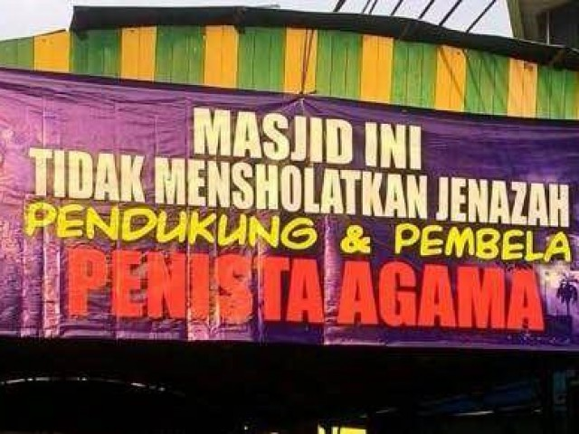

> Membungkus kotoran dengan sebuah kertas halaman kitab suci adalah gambaran yang tepat ketika seseorang menggunakan agama untuk kepentingan politik
>
> -- Myself

## Mengapa begitu?

Disaat agama yang terlalu suci/sakral derajatnya, dan bercampur dengan kotornya kepentingan politik, maka itu adalah manuver yang sangat menjijikan yang pernah dilakukan oleh politisi.

### Ask #1: Tapi agama kamu kan ada hukumnya, dan hukum itu wajib dijalankan?

Pertama, negara saya bukan "negara syariat islam" seperti Arab Saudi dan Iran. Ketuhanan yang maha esa berarti negara memperbolekan warga memeluk agamanya masing masing dan melakukan ajaran agama yang diakui oleh negara. Agama tertentu tidak boleh mengusik urusan agama lain dan umat beragama harus hidup bertoleransi.

Ya tentu islam mengajarkan sharia, namun Ketika itu bertemu dengan kepentingan politik yang merugikan orang lain, itu menjadi sebuah penistaan yang terbesar terhadap agama.

### Ask #2: Pandanganmu terhadap politik?

Politik adalah kepentingan. Apapun itu kepentingan tetaplah kepentingan, di politik kamu akan menggunakan segala cara untuk mencapai suatu agenda.

### Ask #3: Contoh?

Apapun agendanya, misal kepentingan politikmu ingin menumbangkan sebuah kekuasaan yang menurutmu dzalim diatasmu, tentu kamu harus berpolitik untuk mencapai kepentinganmu, kau akan memulai sebuah revolusi, tragedi berdarah mungkin tarjadi, dan Ketika kamu memobilisasi massa yang dibalut dengan agama, maka bukan tidak mungkin, massa menggunakan dalil dalil agama sebagai pembelaan dan pembenaran untuk melakukan hal yang justru dilarang oleh agama tersebut.

### Ask #4: Kenapa kamu sangat khawatir akan hal ini?

> Jika ingin menguasai orang bodoh, bungkuslah sesuatu yang batil dengan agama
>
> -- Ibn Rushd

Politisasi agama sangat mudah dilakukan Ketika suatu kelompok sudah putus asa, berfikir secara irrasional, dan selalu menggunakan dalil dalil agama sebagai pembenaran atas apa yang dia lakukan.

Mentalitas seperti ini biasanya <u>terjadi karena faktor ekonomi dan kurangnya pengetahuan dan literasi seseorang</u> sehingga dia selalu menggunakan agama dimanapun sebagai pembenaraannya

Karena dalil agama selalu menawarkan alternatif yang singkat dan sangat mudah dicerna bagi siapapun, namun kenyataannya bukan seperti itu.

## Kesakralan Al-Quran

Interpretasi seseorang terhadap dalil alquran berbeda beda tergantung seberapa rasional atau berpengetahuannya seseorang untuk menafsirkan isi yang ada dalam kitab tersebut.

Misal, alquran itu kitab/buku yang sangat sakral isinya dan tulisannya. Namun menjadi tidak sakral dan tidak suci Ketika manusia meng-interptetasinya / menafsirkanya.

Atau, tulisan yang ada di alquran itu sangat sacral tulisannya, namun Ketika itu sudah menjadi pemikiran manusia, mereka hanya akan bisa menafsirkannya terbatas pada akal manusia. Karena kalimat yang turun dari tuhan itu absolut dan tidak ada tafsiran yang absolut Ketika itu di interpretasikan oleh manusia.

